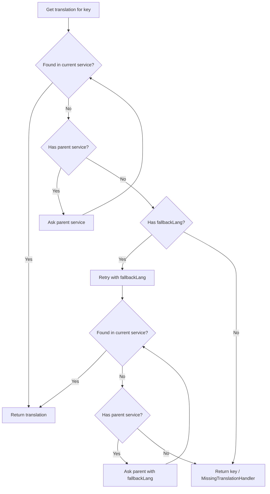
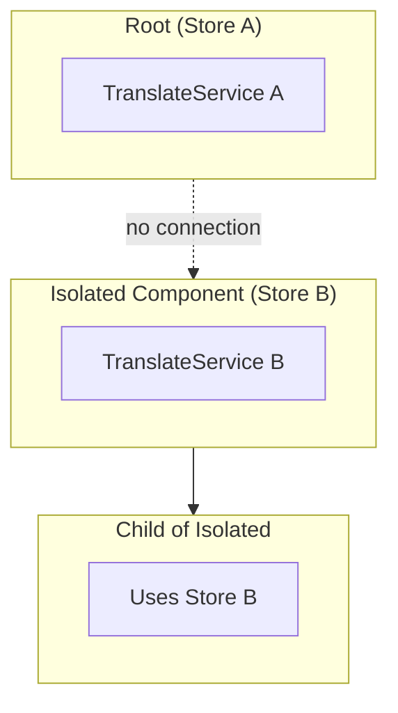
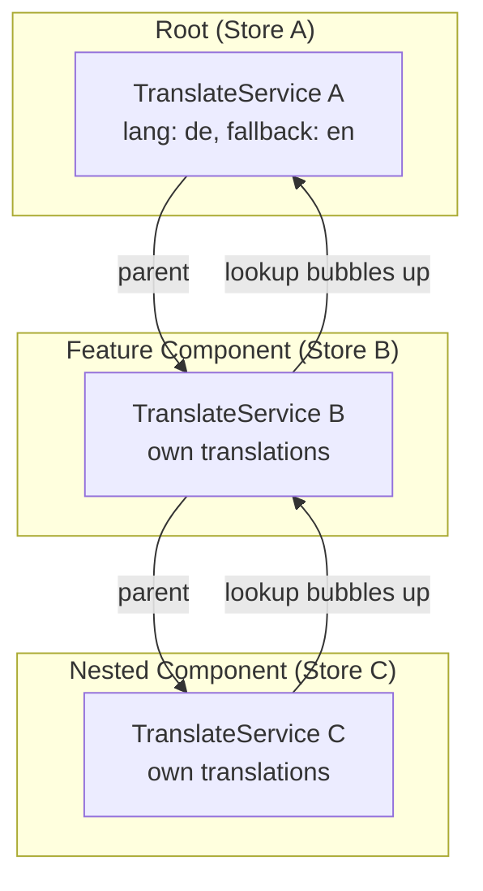
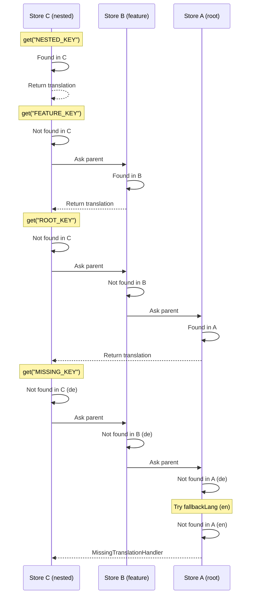
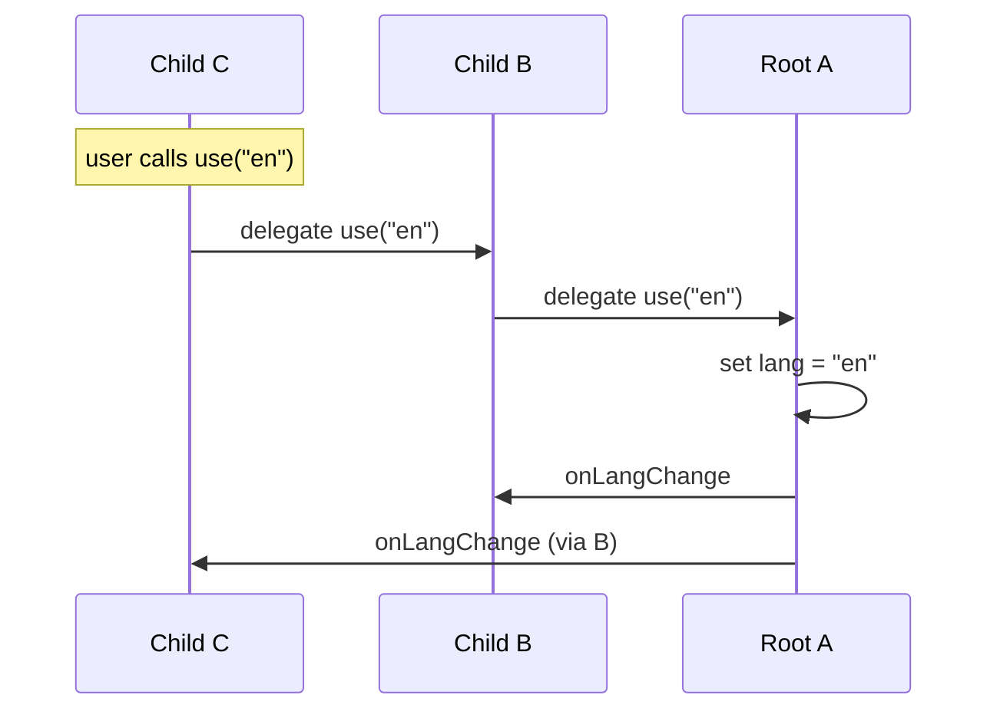
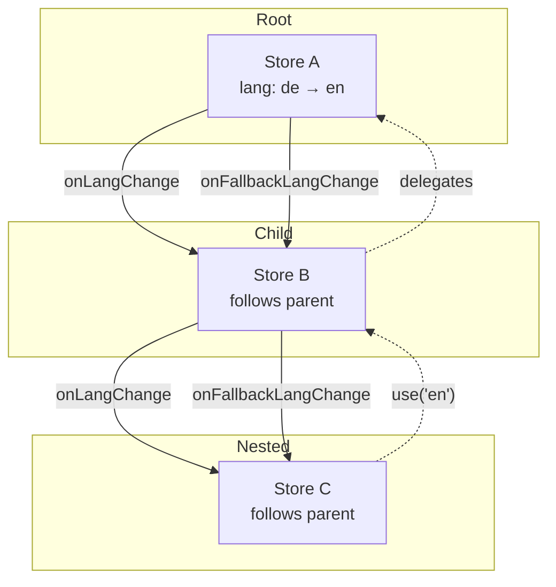
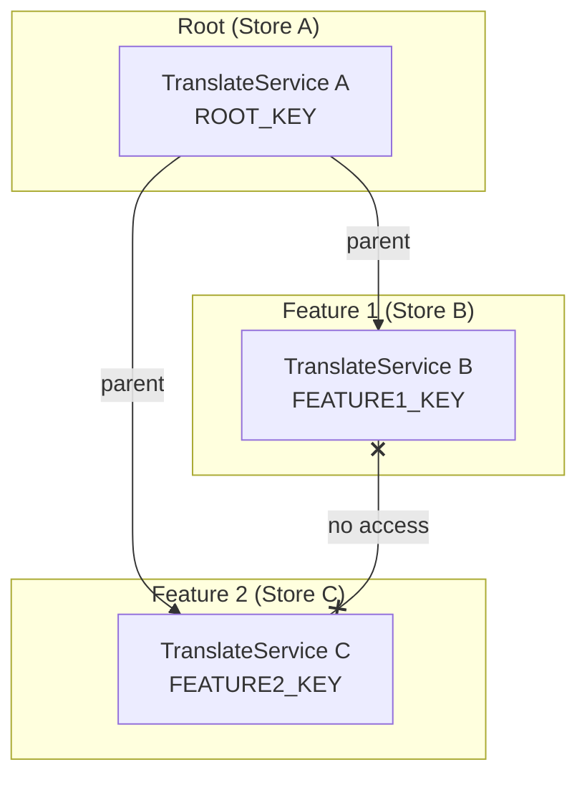

# Providers and Scoping

## Overview

By default, a single `TranslateService` exists at the application root. All pipes, directives, and components use this service. Additional services can be created in two modes:

1. **Isolated** - Completely standalone, not connected to any parent
2. **Connected** - Linked to parent, with translation lookup bubbling up the hierarchy

## Configuration

### Root Service

```typescript
provideTranslateService({
  fallbackLang: "en",
  lang: "de",
  loader: provideTranslateHttpLoader({ prefix: "./i18n/" }),
  compiler: ...,
  parser: ...,
  missingTranslationHandler: ...
})
```

- User can provide loader, compiler, parser, missingTranslationHandler
- If not provided, defaults are used
- `fallbackLang` replaces deprecated `defaultLang` + `useDefaultLang`

### Child Service (Connected)

```typescript
provideChildTranslateService({
  loader: provideTranslateHttpLoader({ prefix: "./i18n-feature/" }),
  compiler: ...,
  parser: ...,
  missingTranslationHandler: ...
})
```

- Uses parent's `lang` and `fallbackLang`
- Loads its own translations via provided loader
- Falls back to parent if translation not found

## Translation Lookup

When a connected child service looks up a translation:



## Scoping Modes

### Isolated

Each `provideTranslateService()` creates a completely independent service with its own store. No connection to parent.



```typescript
// app.config.ts
provideTranslateService({ lang: "en" })

// feature.component.ts - creates isolated service
@Component({
  providers: [
    provideTranslateService({
      lang: "de",
      loader: provideTranslateHttpLoader({ prefix: "./feature-i18n/" })
    })
  ]
})
```

### Connected (Hierarchical)

Each `provideChildTranslateService()` creates a service that is linked to its parent. Translation lookups bubble up.



```typescript
// app.config.ts
provideTranslateService({ lang: "de", fallbackLang: "en" })

// feature.component.ts - connected to root
@Component({
  providers: [
    provideChildTranslateService({
      loader: provideTranslateHttpLoader({ prefix: "./feature-i18n/" })
    })
  ]
})

// nested.component.ts - connected to feature
@Component({
  providers: [
    provideChildTranslateService({
      loader: provideTranslateHttpLoader({ prefix: "./nested-i18n/" })
    })
  ]
})
```

### Example: Translation Lookup in Connected Hierarchy



## Language Changes

In connected mode, children do not have their own `lang` or `fallbackLang`. When a child calls `use()` or `setFallbackLang()`, it delegates to the parent, which propagates the change down to all children:





This ensures all connected services always share the same language.

## Sibling Isolation

Siblings share access to parent translations but **not** to each other's translations:



- Feature 1 can access `ROOT_KEY` (via parent) but **not** `FEATURE2_KEY`
- Feature 2 can access `ROOT_KEY` (via parent) but **not** `FEATURE1_KEY`
- Each feature's translations are isolated from siblings

## MissingTranslationHandler Resolution

When a translation key is not found anywhere in the hierarchy, the `MissingTranslationHandler` is invoked from the **closest** service that has one configured:

- If the child service has a custom handler → use it
- Otherwise, bubble up to find the nearest ancestor with a handler
- If none configured, use the default handler

## Migration from Module-based API

The module-based API (`TranslateModule.forRoot()` / `forChild()`) is removed. The provider-based API works in both standalone and module-based applications.

### Root Configuration

```typescript
// Before (module-based)
@NgModule({
    imports: [
        TranslateModule.forRoot({
            defaultLang: "en",
            useDefaultLang: true,
            loader: {
                provide: TranslateLoader,
                useFactory: (http: HttpClient) => new TranslateHttpLoader(http),
                deps: [HttpClient],
            },
        }),
    ],
})
export class AppModule {}

// After (works in both standalone and module-based apps)
@NgModule({
    providers: [
        provideTranslateService({
            fallbackLang: "en", // replaces defaultLang + useDefaultLang
            loader: provideTranslateHttpLoader(),
        }),
    ],
})
export class AppModule {}

// Or in standalone app
bootstrapApplication(AppComponent, {
    providers: [
        provideTranslateService({
            fallbackLang: "en",
            loader: provideTranslateHttpLoader(),
        }),
    ],
});
```

### Child/Feature Configuration

```typescript
// Before (module-based)
@NgModule({
    imports: [
        TranslateModule.forChild({
            extend: true,
            loader: {
                provide: TranslateLoader,
                useFactory: (http: HttpClient) => new TranslateHttpLoader(http, "./feature-i18n/"),
                deps: [HttpClient],
            },
        }),
    ],
})
export class FeatureModule {}

// After (works in both standalone and module-based apps)
@NgModule({
    providers: [
        provideChildTranslateService({
            loader: provideTranslateHttpLoader({ prefix: "./feature-i18n/" }),
        }),
    ],
})
export class FeatureModule {}
```

### Key Changes

| Old API                                       | New API                          | Notes                                                |
| --------------------------------------------- | -------------------------------- | ---------------------------------------------------- |
| `TranslateModule.forRoot()`                   | `provideTranslateService()`      | Use in `providers` array                             |
| `TranslateModule.forChild({ extend: true })`  | `provideChildTranslateService()` | Connected mode is now the default for child services |
| `TranslateModule.forChild({ isolate: true })` | `provideTranslateService()`      | Creates isolated service                             |
| `defaultLang` + `useDefaultLang: true`        | `fallbackLang`                   | Simplified API                                       |
| `defaultLang` + `useDefaultLang: false`       | (removed)                        | Use `fallbackLang: undefined` if no fallback desired |

### TranslatePipe and TranslateDirective

These remain unchanged. Import them directly:

```typescript
// Standalone component
@Component({
  imports: [TranslatePipe, TranslateDirective]
})

// Or import the module (still available for convenience)
@NgModule({
  imports: [TranslateModule]  // just exports pipe + directive, no providers
})
```

## Summary

| Provider                         | Creates Store   | Lang/Fallback | Translation Lookup   |
| -------------------------------- | --------------- | ------------- | -------------------- |
| `provideTranslateService()`      | Yes (isolated)  | Own           | Own + fallbackLang   |
| `provideChildTranslateService()` | Yes (connected) | From parent   | Bubbles up to parent |
